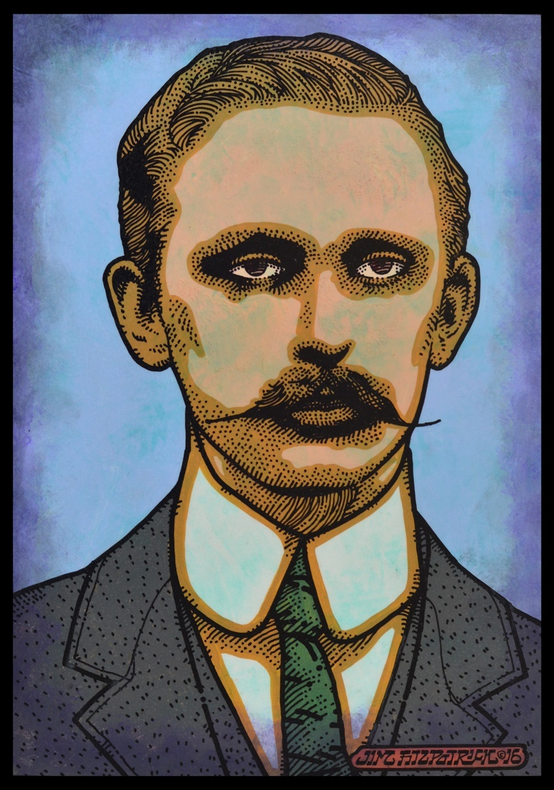
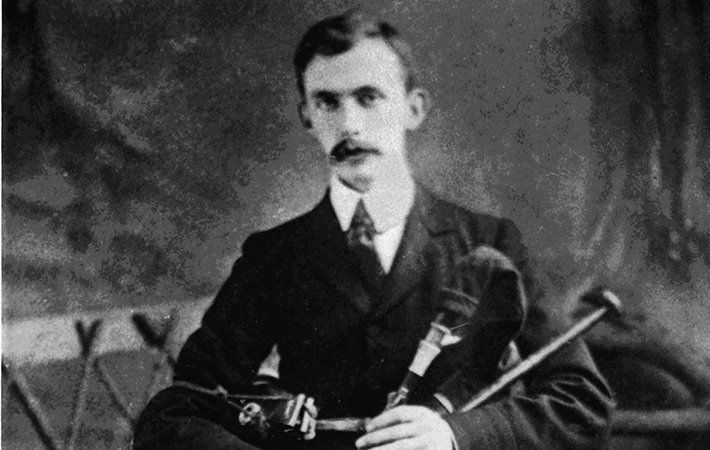
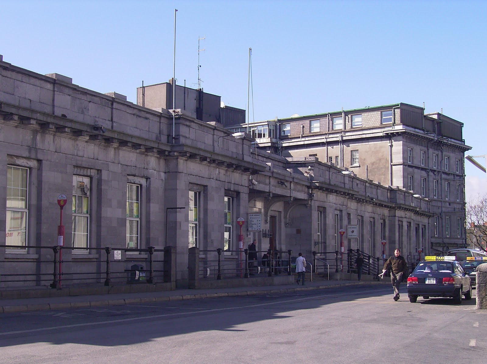
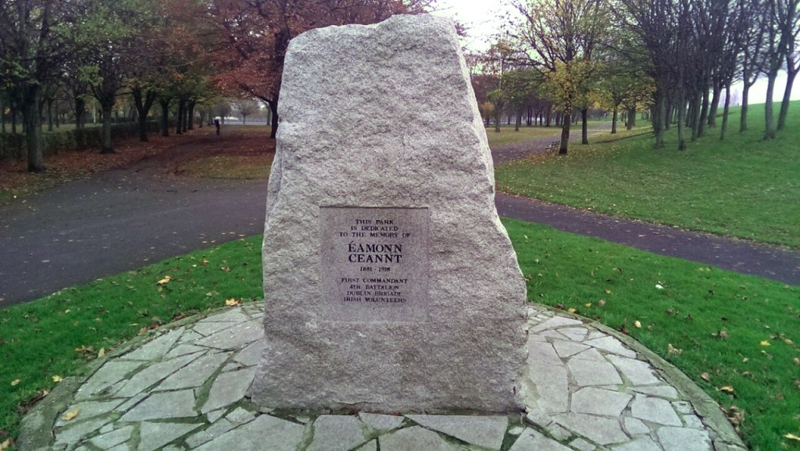

Arguably the least well known of the seven signatories
Ceannt was born in the little village of [Ballymoe](https://en.wikipedia.org/wiki/Ballymoe), overlooking the River Suck in County Galway. His parents were James Kent (4 July 1839 – 1895) and Joanne Galway.
They were a very religious Catholic family and it has been said that Ceannt's religious teaching as a child stayed with him for the rest of his life.

## Gaelic League

In 1899, Ceannt joined the central branch of the [Gaelic League](http://www.askaboutireland.ie/learning-zone/primary-students/looking-at-places/meath/fr.-eugene-ogrowney/the-gaelic-league/). It was here where he first met many of the men who would play a major role in the rising, including [Patrick Pearse](https://en.wikipedia.org/wiki/Patrick_Pearse) and [Eoin MacNeill](https://en.wikipedia.org/wiki/Eoin_MacNeill). He became increasingly involved in Nationalist movements and had a strong interest in the Irish language. The main purposes of the league were to educate people on the Irish culture, revive the Irish language along with Irish music, dancing, poetry, literature and history. Ceannt was an extremely committed member to the league

## Easter rising

He was made commandant of the 4th Battalion of the Volunteers, and during the Rising was stationed at the [South Dublin Union](https://www.theirishstory.com/2016/02/25/the-battle-at-south-dublin-union-1916/), with more than 100 men under his command, notably his second-in-command Cathal Brugha, and W. T. Cosgrave. The South Dublin Union controlled a large area south of Kilmainham around [Dolphin's Barn](https://en.wikipedia.org/wiki/Dolphin%27s_Barn).

Ceannt used a contingent at the Marrowbone Lane Distillery to enfilade the passing soldiers; grinding attacks broke through to the Women's Infirmary. On Tuesday 25 April, the British could have closed off the battle, but failed to press home the advantage when the 4th Royal Dublin Fusiliers arrived, and Ceannt continued to hold out with 20 times fewer men. On Thursday 27 April, a British battalion made south, as far as the [Rialto Bridge](https://en.wikipedia.org/wiki/Rialto_Bridge), when Ceannt's outposts opened fire.

The British were forced to tunnel into the buildings and, as Ceannt's numbers reduced, it was increasingly involved in close quarter fighting. His unit saw intense fighting at times during the week, but surrendered when ordered to do so by his superior officer Patrick Pearse.

> I shall die, like a man for Ireland's sake.

## Execution

In July 1926, the Irish Independent published an article that included Eamonn Ceannt's last message, written a few hours before his execution from cell 88, [Kilmainham Gaol](https://en.wikipedia.org/wiki/Kilmainham_Gaol), on 7 May 1916.

> I leave for the guidance of other Irish Revolutionaries who may tread the path which I have trod this advice, never to treat with the enemy, never to surrender at his mercy, but to fight to a finish...Ireland has shown she is a nation. This generation can claim to have raised sons as brave as any that went before. And in the years to come Ireland will honour those who risked all for her honour at Easter 1916.

## Legacy

Galway City's [Ceannt Station](https://en.wikipedia.org/wiki/Galway_railway_station), the main bus and rail station in his native county of Galway, is named in his honour, as well as Éamonn Ceannt Park in Dublin.

## Commemorations

[Éamonn Ceannt Park](http://www.dublincity.ie/main-menu-services-recreation-culture-dublin-city-parks-visit-park/eamonn-ceannt-park) in Dublin.

## Gravesite

Eamonn is buried in [Arbour Hill Cemetary](https://en.wikipedia.org/wiki/Arbour_Hill_Prison) information on his grave can be found [here](https://www.findagrave.com/memorial/4273/eamonn-ceannt)

## Learn more

Take the [Kilmainham Gaol tour ](http://kilmainhamgaolmuseum.ie/)

Visit the [Collins Barracks](https://www.museum.ie/Decorative-Arts-History/History-Architecture) museum
