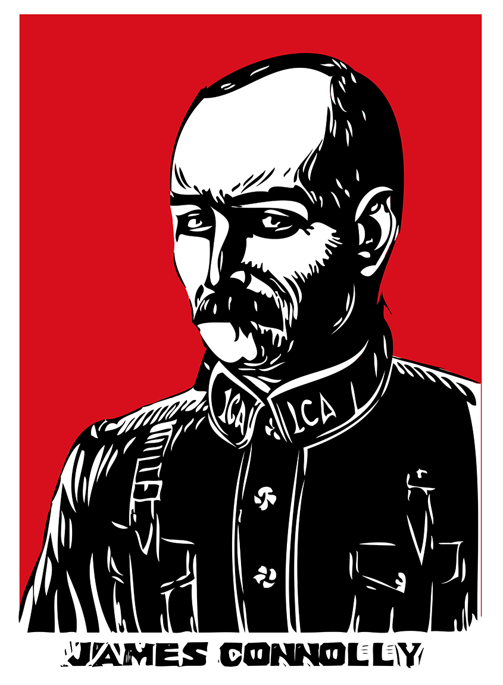
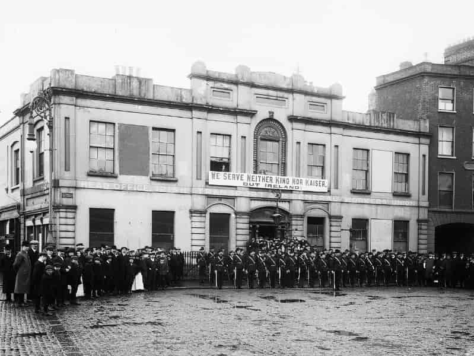
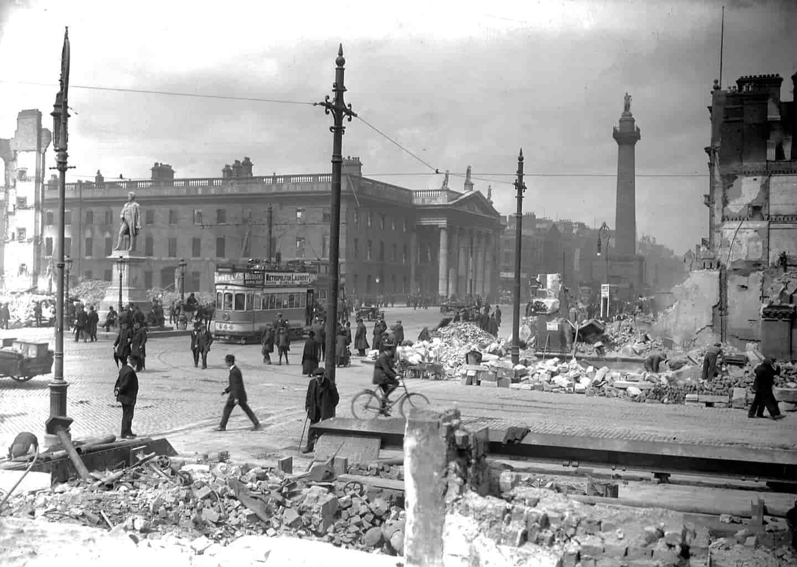
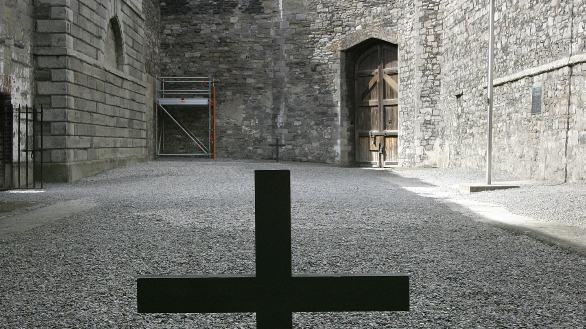
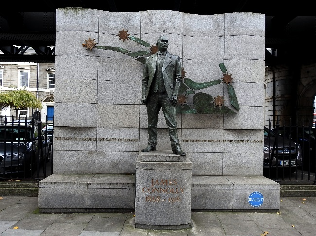

He was born in **Scotland** to Irish immigrant parents. Born in the Cowgate area of Edinburgh in **1868** to parents from **Monaghan.**

He was a founder of the [ Irish Citizens' Army.](https://en.wikipedia.org/wiki/Irish_Citizen_Army)

####Connolly once said on workers rights

> Parliamentary democracy gives to the worker the right to a voice in the selection of his rulers but insists that he shall bend as a subject to be ruled.

## Irish citizen army

Came to Dublin in 1896. Finding it hard to find work and becoming disilluioned, left to go to America in 1903.
Seven years later he returned to Ireland to head up the Irish Transport and General Workers Union in Belfast. After the disastrous general strike of 1913 and [Jim Larkin's](https://en.wikipedia.org/wiki/James_Larkin) departure for America Connolly came to Dublin to head up the local ITGWU—and its [Irish Citizen Army](https://en.wikipedia.org/wiki/Irish_Citizen_Army)

The Citizen Army became his obsession. Although only 220 in strength, he drilled them until they became, in his words, “a real revolutionary army.”

## Beginning of the rising

The Irish Volunteers did not trust the **Citizen Army**. James Connolly was kidnapped by members of the senior [IRB council](https://en.wikipedia.org/wiki/Irish_Republican_Brotherhood) and held for
3 days. As details of the rising became known to him, Connolly became a supporter and agreed to become involved in it.

## The charge!

On Easter Monday he was named **Vice-President of the Provisional Government** and **Commandant-General** in the Army of the Irish Republic. He marched at the head of his Citizen Army to the [GPO](https://en.wikipedia.org/wiki/General_Post_Office,_Dublin) and, finding his inner-Teddy Roosevelt at San Juan Hill, commanded his troops: **“Left turn. CHARGE!”** After Pearse read the [Proclamation](https://en.wikipedia.org/wiki/Proclamation_of_the_Irish_Republic) Connolly exclaimed, “Thanks be to God, Pearse, that we have lived to see this day.”

## Badly inured

As James Connolly led the troops in the street fighting, he was shot in the leg near the [Ha’penny Bridge](https://en.wikipedia.org/wiki/Ha%27penny_Bridge).
He made his way back to the GPO and helped plan the evacuation to Moore Street. After the surrender he was removed to [Dublin Castle](https://en.wikipedia.org/wiki/Dublin_Castle) for treatment for his wound which had developed gangrene.

## The trial

####His condition was such that his trial was held at Dublin Castle. After he was found guilty and condemned to death he made this statement:

Connolly said during
[his trial](<https://www.irishcentral.com/roots/history/easter-rising-leader-executed-in-1916-james-connolly)>).

> We went out to break the connection between this country and the British Empire and to establish an Irish Republic. We believe that the call we thus issued to the people of Ireland was a nobler call in a holier cause that [sic] any call issued to them during this war having any connection with the war. We succeeded in proving that Irishmen are ready to die endeavoring to win for Ireland their national rights which the British Government has been asking them to die to win for Belgium. As long as that remains the case the cause of Irish freedom is safe. Believing that the British Government has no right in Ireland, never had any right in Ireland, and never can have any right in Ireland, the presence in any one generation of even a respectable minority of Ireland ready to die to affirm that truth make sure Government for ever a usurpation and a crime against human progress. I personally thank God that I have lived to see the day when thousands of Irishmen and boys, and hundreds of Irish women and girls, were equally ready to affirm that truth and seal it with their lives if necessary.

## Final hours

####His last hours were spent with his wife Lillie and daughter Nora. His daughter Nora Described their finals moments together

> We passed through the soldiers and entered an enclave where there were two soldiers with fixed bayonets. They stood aside to let us enter the door. When we entered my father was lying in the bed with his head turned to the door.” “Well,” said Connolly to his wife, “I suppose you know what this means.” Lillie responded, “Not that James, not that.”
> Nora continued: “My father said, ‘Yes, for the first time I dropped off to sleep. And they wakened me to tell me that I was to be shot at dawn.’ ” Lillie said, “Your life, James, your beautiful life.” “Well, Lillie,” he answered, “hasn’t it been a full life, and isn’t this a good end?”

He was removed to [Kilmainham](https://en.wikipedia.org/wiki/Kilmainham_Gaol). There, **Father Aloysius** asked him to forgive the men of the firing squad. “I do, Father,” said Connolly. “I respect every man who does his duty.”
It is at this time that Connolly went from martyr to legend. Because his wounds were so severe he could not stand, so they tied him to the chair.

A memorial exists across from Bus Aras to **James Connolly**, hero of Ireland.

## Gravesite

James is buried in [Arbour Hill Cemetary](https://en.wikipedia.org/wiki/Arbour_Hill_Prison) information on his grave can be found [here](https://www.findagrave.com/memorial/4276/james-connolly)

## Learn more

Take the [Kilmainham Gaol tour ](http://kilmainhamgaolmuseum.ie/)

Visit the James Connolly [Museum](https://arasuichonghaile.com/)
