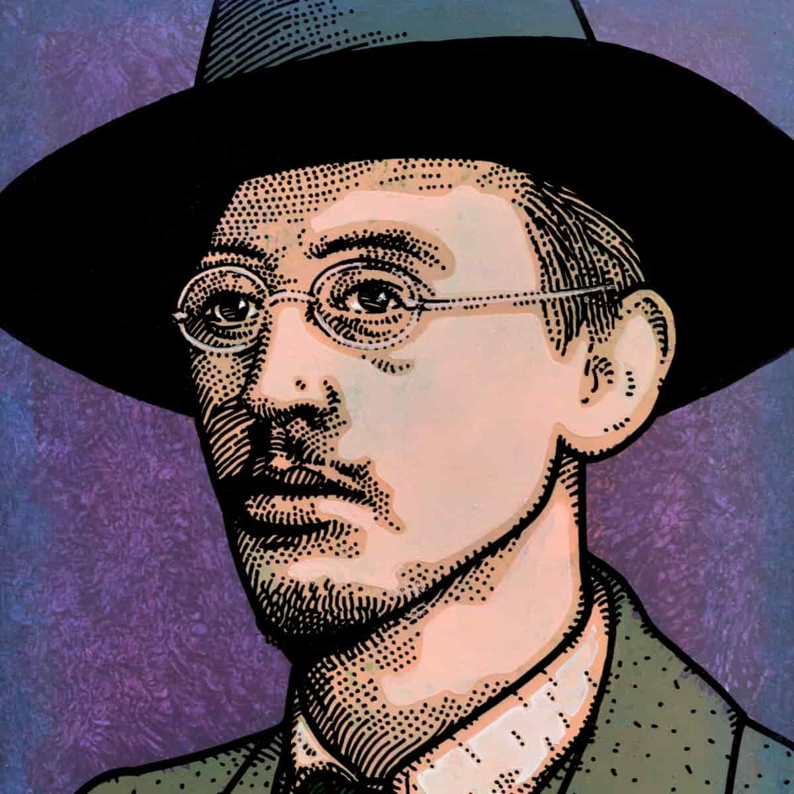
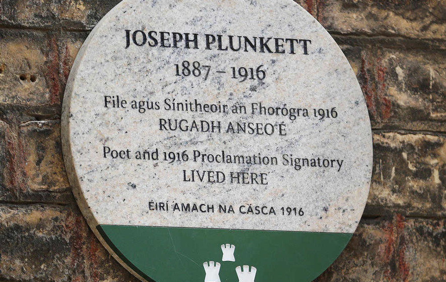

Joseph Mary Plunkett was the son of [Horace Plunkett](https://en.wikipedia.org/wiki/Horace_Plunkett), a Papal Count. He was born in **Dublin** in 1887. If there was one renaissance man involved in the Easter Rising it was Joe Plunkett. 
He was also the youngest signatory of the Proclamation.

## His beginnings

Plunkett was born at **26 Upper Fitzwilliam Street** in one of Dublin's most affluent districts. Both his parents came from wealthy backgrounds.
Plunkett contracted [tuberculosis (TB)](https://en.wikipedia.org/wiki/Tuberculosis) at a young age and spent part of his youth in the warmer climates of the **Mediterranean** and **North Africa**.
Throughout his life, Joseph Plunkett took an active interest in Irish heritage and the Irish language.
He studied with [Thomas MacDonagh](https://en.wikipedia.org/wiki/Thomas_MacDonagh) both of who were early members of the [Irish Volunteers](https://en.wikipedia.org/wiki/Irish_Volunteers).

## IRB involvement

Sometime in 1915 Joseph Plunkett joined the [Irish Republican Brotherhood](https://en.wikipedia.org/wiki/Irish_Republican_Brotherhood) and soon after was sent to **Germany** to meet with [Roger Casement](https://en.wikipedia.org/wiki/Roger_Casement), who was negotiating with the German government on behalf of **Ireland**. The were seeking weapons and the release of Irish prioners of war to fight on behalf of **Ireland** at home. During a conversation at this time Joseph even suggested it would be
benifical for Ireland to crown a **German** prince or king in **Ireland**.

Many know Joe Plunkett for the famous song about his marraige to [Grace Gifford](https://en.wikipedia.org/wiki/Grace_Gifford)

> Oh Grace, just hold me in your arms and let this moment linger / They’ll take me out at dawn and I will die / With all my love I place this wedding ring upon your finger / There won’t be time to share our love for we must say goodbye.

## Easter rising

Plunkett was one of the original members of the IRB Military Committee that was responsible for planning the Easter Rising, and it was largely his plan that was followed. Shortly before the rising was to begin, Plunkett was hospitalised following a turn for the worse in his health.
He did however take his place in the rising in the [GPO](https://en.wikipedia.org/wiki/General_Post_Office,_Dublin).
When the Proclamation of Independence was read out by [Padraig Pearse](https://en.wikipedia.org/wiki/Patrick_Pearse) in front of a confused crowd at the [GPO](https://en.wikipedia.org/wiki/General_Post_Office,_Dublin) it had been signed by seven men and Plunkett, at the age of 28, was the youngest of the signatories.

After fierce and bloody fighting which lasted for six days, the Commander in Chief of the rebels, [Padraig Pearse](https://en.wikipedia.org/wiki/Patrick_Pearse) , ordered the rebels to surrender. Plunkett, at the time, had escaped from the [GPO](https://en.wikipedia.org/wiki/General_Post_Office,_Dublin) and was fighting in Moore Street. After the surrender, he was detained by the British in [Kilmainham](https://en.wikipedia.org/wiki/Kilmainham_Gaol).

## Marraige to Grace Glifford

One of the more poignent moments of the rising was the marraige of Joseph Plunkett to [Grace Gifford](https://en.wikipedia.org/wiki/Grace_Gifford).
As Plunkett had been sentanced to execution and awaited his fate, he married Grace in a small chapel in [Kilmainham Goal](https://en.wikipedia.org/wiki/Kilmainham_Gaol).
This marraige was immortalised in the song [Grace](https://www.youtube.com/watch?v=920WD_eEpp4).

### Plunkett said in his final words

> I am very happy I am dying for the glory of God and the honour of Ireland

## Execution

Immediately after the ceremony Joseph and Grace were separated. A couple of hours later the couple was allowed to meet again for ten minutes (timed on a watch). Again, there were not given the courtesy of privacy but were guarded by a force of 15 armed soldiers.
He was killed alongside Edward Daly, Willy Pearse, and Michael O’ Hanrahan.

## Commemorations

In May 2016 a plaque was unveiled at 26 Upper Fitzwilliam Street - the Irish Republican Brotherhood member's childhood home.

## Gravesite

Joseph is buried in [Arbour Hill Cemetary](https://en.wikipedia.org/wiki/Arbour_Hill_Prison) information on his grave can be found [here](https://www.findagrave.com/memorial/4268/joseph-mary-plunkett)

## Learn more

Take the [Kilmainham Gaol tour ](http://kilmainhamgaolmuseum.ie/)

Visit the [Walking rebellion tour](http://www.1916rising.com/bioPlunkett.html)