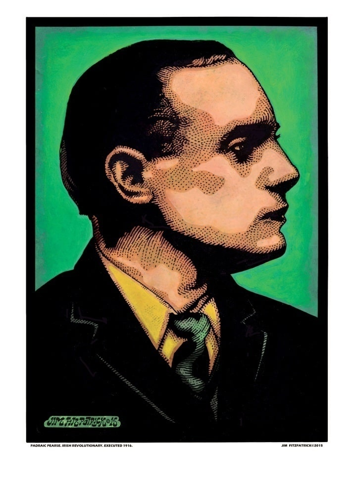
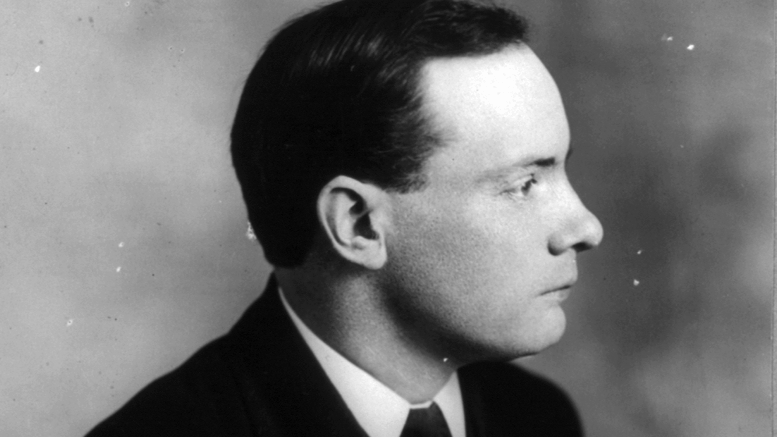
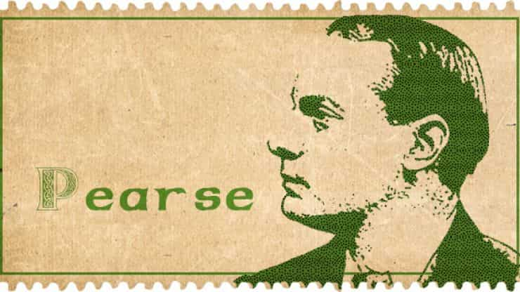
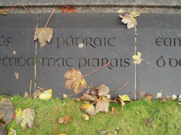

He was born in 1879 in Dublin. Following his execution along with fifteen others, Pearse came to be seen by many as the embodiment of the rebellion.

Pearse, his brother [Willie](https://en.wikipedia.org/wiki/Willie_Pearse), and his sisters Margaret and Mary Brigid were born at 27 Great Brunswick Street, Dublin, the street that is named after them today.

## Early life and influences

Pearse, his brother [Willie](https://en.wikipedia.org/wiki/Willie_Pearse), and his sisters [Margaret](https://en.wikipedia.org/wiki/Margaret_Mary_Pearse) and Mary Brigid were born at 27 Great Brunswick Street, Dublin, the street that is named after them today. It was here that their father, James Pearse, established a stonemasonry business in the 1850s, a business which flourished and provided the Pearses with a comfortable middle-class upbringing

## St Enda's

The Irish school system, he believed, raised Ireland's youth to be good Englishmen or obedient Irishmen, and an alternative was needed. Thus for him and other language revivalists saving the Irish language from extinction was a cultural priority of the utmost importance. The key to saving the language, he felt, would be a sympathetic education system. To show the way he started his own bilingual school for boys, [St. Enda's School (Scoil Éanna)](https://en.wikipedia.org/wiki/St._Enda%27s_School) in Cullenswood House in Ranelagh, a suburb of County Dublin, in 1908.

## Irish Republican Brotherhood

Pearse was then one of many people who were members of both the [Irish Republican Brotherhood](https://en.wikipedia.org/wiki/Irish_Republican_Brotherhood) and the Volunteers. When he became the Volunteers' Director of Military Organisation in 1914 he was the highest ranking Volunteer in the IRB membership, and instrumental in the latter's commandeering of the remaining minority of the Volunteers for the purpose of rebellion.On 1 August 1915 Pearse gave a graveside oration at the funeral of the Fenian [Jeremiah O'Donovan Rossa](https://en.wikipedia.org/wiki/Jeremiah_O%27Donovan_Rossa). He was the first republican to be filmed giving an oration. It closed with the words:

> Our foes are strong and wise and wary; but, strong and wise and wary as they are, they cannot undo the miracles of God who ripens in the hearts of young men the seeds sown by the young men of a former generation. And the seeds sown by the young men of '65 and '67 are coming to their miraculous ripening today. Rulers and Defenders of the Realm had need to be wary if they would guard against such processes. Life springs from death; and from the graves of patriot men and women spring living nations. The Defenders of this Realm have worked well in secret and in the open. They think that they have pacified Ireland. They think that they have purchased half of us and intimidated the other half. They think that they have foreseen everything, think that they have provided against everything; but, the fools, the fools, the fools! – They have left us our Fenian dead, and while Ireland holds these graves, Ireland unfree shall never be at peace

## Easter Rising

Pearse was one of only 30 people to know that the Rising would take place in the days building up to Easter 1916. Pearse, who had been secretly planning the insurrection for two years beforehand, even kept his plans hidden from the highest leaders in the Irish Republican Brotherhood, including Eoin MacNeill, the Chief of Staff of the IRB.

When the Easter Rising eventually began on Easter Monday, 24 April 1916, it was Pearse who read the [Proclamation of the Irish Republic](https://en.wikipedia.org/wiki/Proclamation_of_the_Irish_Republic) from outside the [GPO](https://en.wikipedia.org/wiki/General_Post_Office,_Dublin) , the headquarters of the Rising. Pearse was the person most responsible for drafting the Proclamation, and he was chosen as President of the Republic. After six days of fighting, heavy civilian casualties and great destruction of property, Pearse issued the order to surrender.

## Death

Pearse and fourteen other leaders, including his brother Willie, were court-martialled and executed by firing squad. [Thomas Clarke](https://shorthistorys.com/thomas-clarke/), [Thomas MacDonagh](https://en.wikipedia.org/wiki/Thomas_MacDonagh) and Pearse himself were the first of the rebels to be executed, on the morning of 3 May 1916. Pearse was 36 years old at the time of his death.

### Writings

Pearse wrote stories and poems in both Irish and English. His best-known English poems include ["The Mother"](https://ireland-calling.com/the-mother/), ["The Fool"](https://www.thefuture.ie/the-fool-a-poem-by-padraig-mac-piarais/), ["The Rebel"](https://ansionnachfionn.com/2016/05/03/the-rebel-patrick-h-pearse/) and ["The Wayfarer"](https://www.independent.ie/irish-news/1916/rising-poems-the-wayfarer-by-patrick-pearse-34222347.html). He also wrote several allegorical plays in the Irish language, including The King, The Master, and The Singer. His short stories in Irish include Eoghainín na nÉan ("Eoineen of the Birds"), Íosagán ("Little Jesus"), An Gadaí ("The Thief"), Na Bóithre ("The Roads"), and An Bhean Chaointe ("The Keening Woman").

## Commemorations

The building in Rathfarnham, on the south side of Dublin, that once housed Pearse's school, St Enda's, is now the [Pearse museum](https://en.wikipedia.org/wiki/Pearse_Museum).
[Pearse street](https://en.wikipedia.org/wiki/Pearse_Street) and [Pearse sqaure](https://en.wikipedia.org/wiki/Pearse_Square) in Dublin were renamed in 1926 in honour of Pearse and his brother Willie, Pearse Street (previously Great Brunswick Street) being their birthplace.

## Gravesite

Padraig is buried in [Arbour Hill Cemetary](https://en.wikipedia.org/wiki/Arbour_Hill_Prison) information on his grave can be found [here](https://www.findagrave.com/memorial/2006/patrick-henry-pearse)

## Learn more

Take the [Pearse museum tour ](http://pearsemuseum.ie/)

Visit the [Collins Barracks](https://www.museum.ie/Decorative-Arts-History/History-Architecture) museum
