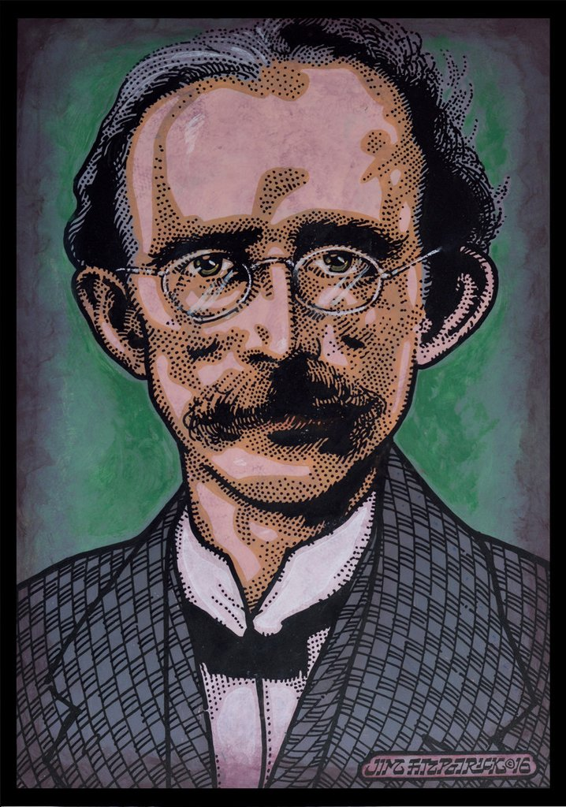
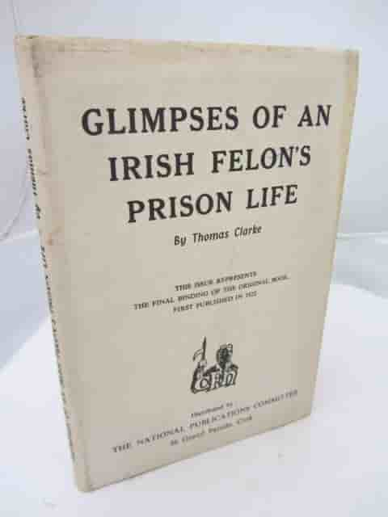
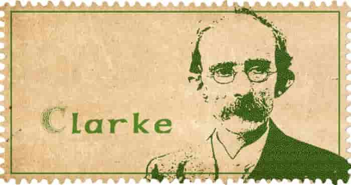
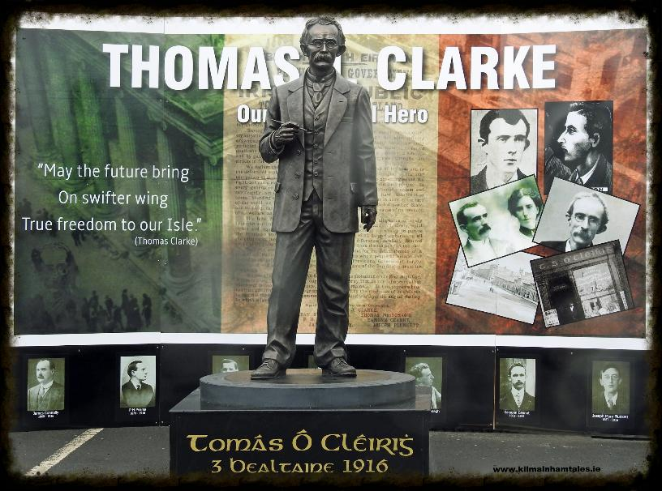

He was born in 1857 in Tipperary to an Irish protestant father, the British Army bombardier James Clarke.

He spent the first 7 years of his life in **South Africa.**

####Clarke said this on his participation in the Easter Rising

> I and my fellow signatories believe we have struck the first successful blow for Irish freedom. The next blow, which we have no doubt Ireland will strike, will win through. In this belief, we die happy.

## Irish Republican Brotherhood

In 1878, at the age of 20, he joined the [Irish Republican Brotherhood (IRB)](https://en.wikipedia.org/wiki/Irish_Republican_Brotherhood) following the visit to Dungannon by John Daly, and by 1880 he was centre (head) of the local IRB circle. In August that year, after a member of the 
[Royal Irish Constabulary (RIC)](https://en.wikipedia.org/wiki/Royal_Irish_Constabulary)
 had shot and killed a man during riots between the [Orange Order](https://en.wikipedia.org/wiki/Orange_Order) and the  [Ancient Order of Hibernians (AOH)](https://en.wikipedia.org/wiki/Ancient_Order_of_Hibernians) in Dungannon, Clarke and other IRB members attacked some RIC men in Irish Street. 

## Hard jail time

After a bombing campaign in the UK in 1883, Clarke was captured and would spend the next 15 years doing hard labour in English jails. Clarke would write about this time in his memoir [Glimpses of an Irish felon's prison life.](https://www.sinnfeinbookshop.com/glimpses-of-an-irish-felons-prison-life/)

## America

When Clarke was finally released in 1898, he moved back to the [United States](https://en.wikipedia.org/wiki/United_States), to Brooklyn, where he married [Kathleen Daly](https://en.wikipedia.org/wiki/Kathleen_Clarke). Kathleen was the niece of [John Daly](https://en.wikipedia.org/wiki/John_Daly_(Fenian)), who had persuaded Clarke to join the IRB twenty years earlier, and she was 21 years his junior. They would remain in New York until 1907.

## The spark to set off the rising

Clarks' return to Ireland was the spark that began the blaze of the [1916 easter rising](https://en.wikipedia.org/wiki/Easter_Rising).
Thomas would in 1907 open a tobacconist shop, with Tom immersing himself in reforming the IRB along with his protegé [Sean Mac Diarmada](https://en.wikipedia.org/wiki/Se%C3%A1n_Mac_Diarmada), [Bulmer Hobson](https://en.wikipedia.org/wiki/Bulmer_Hobson) and [Denis McCullough](https://en.wikipedia.org/wiki/Denis_McCullough).

In 1915 Tom and [Sean Mac Diarmada](https://en.wikipedia.org/wiki/Se%C3%A1n_Mac_Diarmada) took over the IRB.
They began to plan the rising. The brought in [James Connolly](https://en.wikipedia.org/wiki/James_Connolly) of the [Irish Citizen Army](https://en.wikipedia.org/wiki/Irish_Citizen_Army)

## The rising

Clarke was stationed at the [GPO](https://en.wikipedia.org/wiki/General_Post_Office,_Dublin) during the rising.
Although he had no formal military rank he was recognised by the garrison as one of the commanders.
Clarke was the first signatory of the [Proclamation of the Irish Republic](https://en.wikipedia.org/wiki/Proclamation_of_the_Irish_Republic). It has been said that Clarke indeed would have been the declared President and Commander-in-chief, but he refused any military rank and such honours; these were given to [Pearse](https://en.wikipedia.org/wiki/Patrick_Pearse), who was more well-known and respected on a national level. Kathleen Clarke later claimed that her husband, and not Pearse, was first president of the Irish Republic
 After a week of heavy fighting the leaders
gathered at a house in Moore Street and the order to surrender was given.

### Clarke wrote on the wall of the house

> We had to evacuate the GPO. The boys put up a grand fight, and that fight will save the soul of Ireland.

## His execution

He was arrested after the surrender. He and other revolutionaries were taken to the Rotunda where he was stripped of his clothing in front of the other prisoners. He was later held in [Kilmainham](https://en.wikipedia.org/wiki/Kilmainham_Gaol). He was court-martialled and executed by firing squad, along with [Pearse](https://en.wikipedia.org/wiki/Patrick_Pearse) and [Thomas MacDonagh](https://en.wikipedia.org/wiki/Thomas_MacDonagh) on 3 May 1916.

Before his execution, he asked his wife Kathleen to give this message to the Irish People:

> My comrades and I believe we have struck the first successful blow for freedom, and so sure as we are going out this morning so sure will freedom come as a direct result of our action...In this belief, we die happy.

####His last hours were spent with his wife Lillie and daughter Nora. His daughter Nora Described their finals moments together

## Commemorations

Thomas Clarke Tower in Ballymun was named after him, with the top floor used a short-stay hotel before its demolition in 2008. [Clarke Train Station](https://en.wikipedia.org/wiki/Dundalk_railway_station) in [Dundalk](https://en.wikipedia.org/wiki/Dundalk) was also named for him. There's a commemorative plaque for Clarke on the corner of [Parnell Street](https://en.wikipedia.org/wiki/Parnell_Street) - where he had his shop - and [O'Connell Street](https://en.wikipedia.org/wiki/O%27Connell_Street), home of the [GPO](https://en.wikipedia.org/wiki/General_Post_Office,_Dublin).

## Gravesite

Thomas is buried in [Arbour Hill Cemetary](https://en.wikipedia.org/wiki/Arbour_Hill_Prison) information on his grave can be found [here](https://www.findagrave.com/memorial/4267/thomas-clarke)

## Learn more

Take the [Kilmainham Gaol tour ](http://kilmainhamgaolmuseum.ie/)

Visit the [Collins Barracks](https://www.museum.ie/Decorative-Arts-History/History-Architecture) museum
